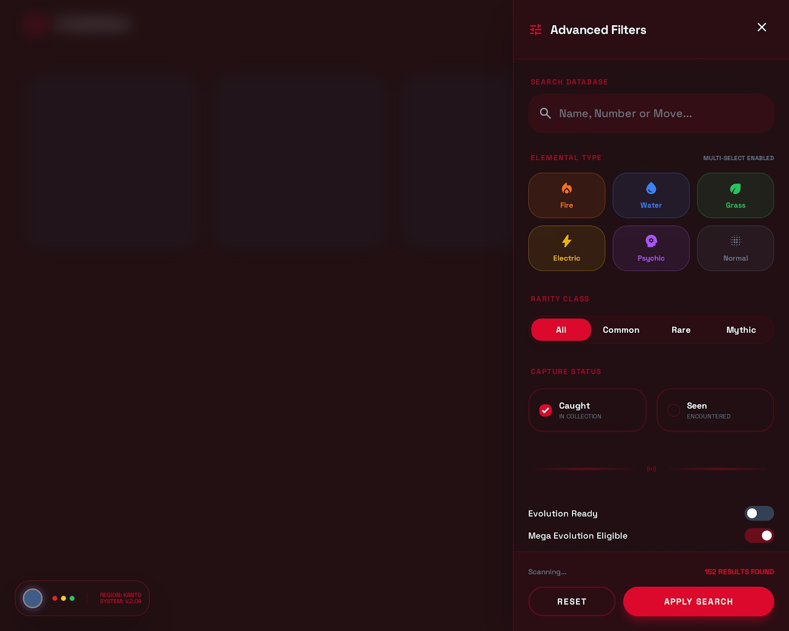
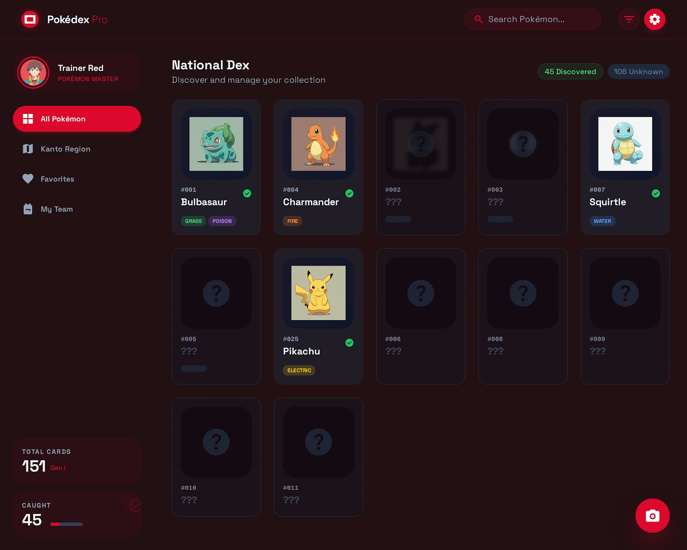
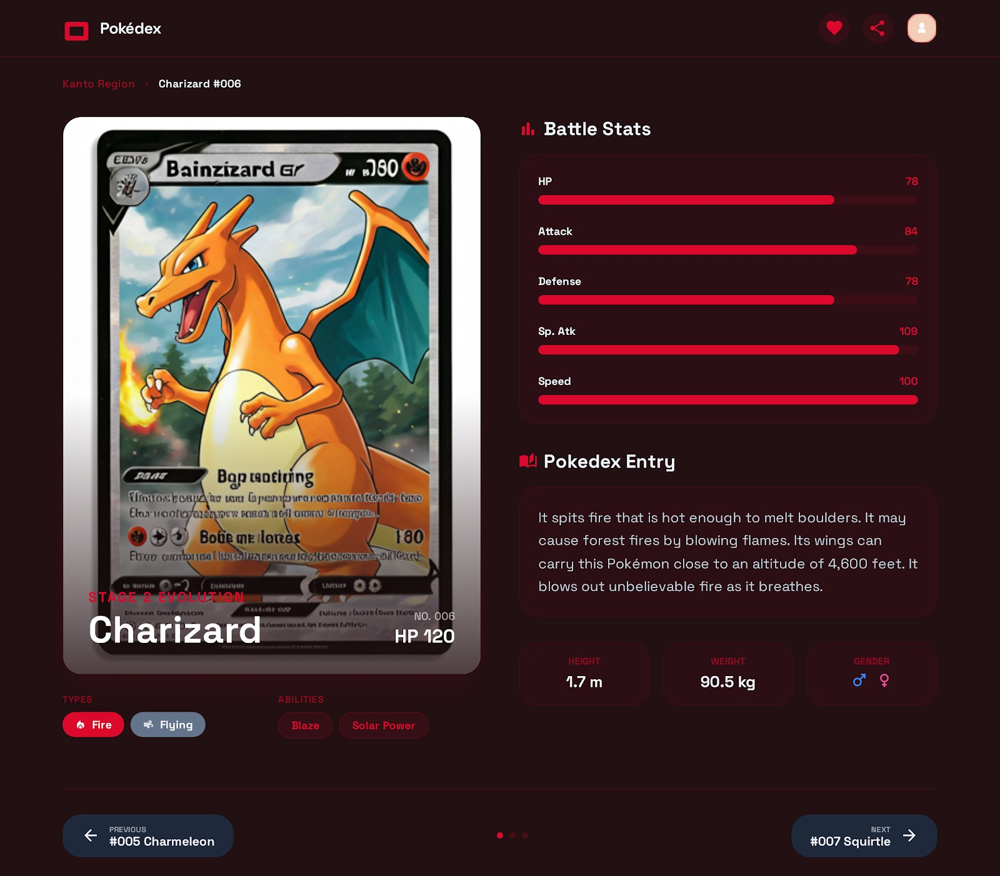
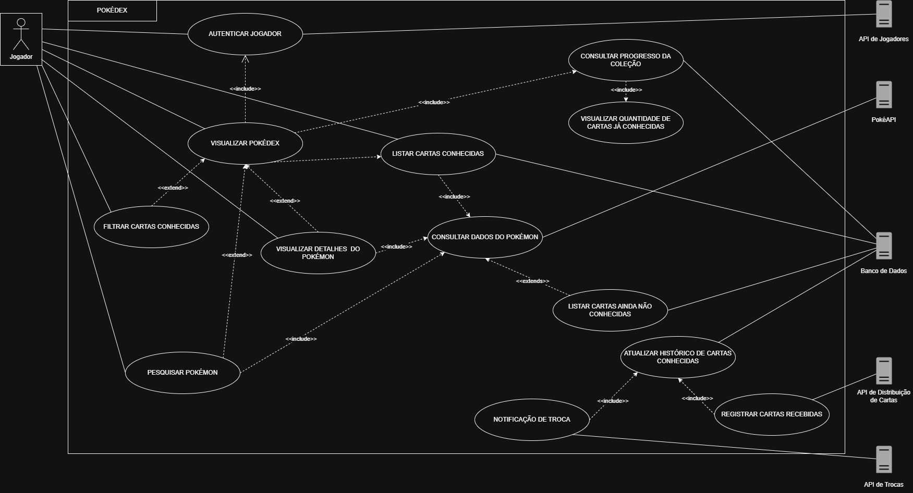
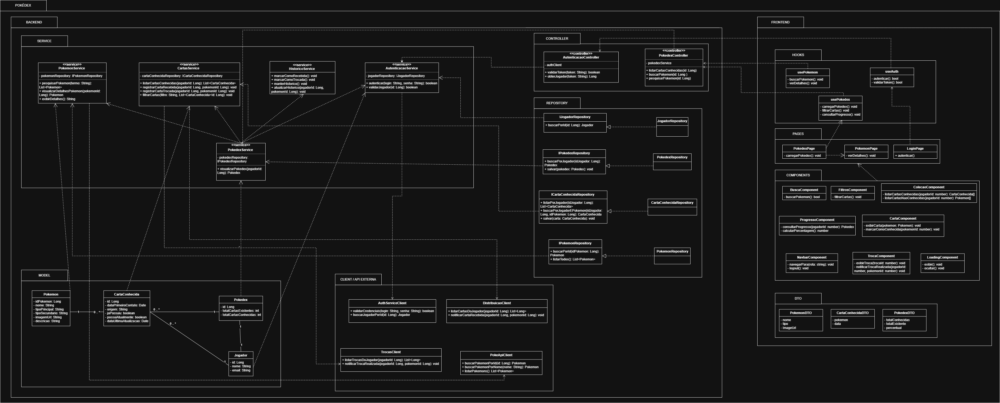

# Aplicação - Pokédex

###### Feito por @JuliaPCaputo @milelaraia @JuliaVicentini @Karolina-Oliveira

Este é um breve resumo de um projeto que envolve a aplicação de frameworks de front-end na página de gerenciamento de cartas de uma Pokédex. O projeto foi desenvolvido para a disciplina de Arquitetura de Software.


## Descrição do projeto

Responsável por gerenciar as cartas conhecidas por cada jogador. A aplicação deve mostrar, por meio de uma interface gráfica, quantas cartas existem e quantas o jogador já conheceu (já teve em seu baralho). Mesmo que um jogador trocar uma carta, as informações da carta trocada continuam disponíveis na lista.

## Ferramentas a serem utilizadas

* React
* TypeScript
* Python
* Flask
* MySQL
* MySQL Workbench

## Implementações

O grupo pretende implementar uma interface front-end que lembre a Pokédex apresentada no anime, fazendo uso de formatos e cores utilizados na animação.
Haverá um espaço reservado para todas as cartas que podem ser conquistadas no jogo, porém, nem todos os espaços estarão com informações visíveis ao jogador, pois só serão revelados aqueles Pokémons conhecidos por ele em algum momento ao longo de sua jornada na aplicação. Além disso, as cartas reveladas contarão com informações essenciais sobre aquele Pokémon, visando o acesso rápido do jogador à características relevantes sobre ele, que serão úteis para as batalhas.

Além disso, a implementação de filtros permitirá ao jogador escolher características relevantes e a aplicação mostrará quais Pokémons de sua coleção enquadram-se naqueles quesitos.

## Wireframes

### Página de Login


### Página Principal



### Coleção de Cartas



### Inspeção de Cartas



## Diagramas

### Casos de Uso



### Classes



## Aplicações de SOLID no projeto

A fim de seguir os princípios SOLID, o diagrama de classes foi alterado.

Para obedecer ao Princípio da Responsabilidade Única (SRP), foram retirados métodos relacionados a cartas e histórico da classe PokedexService, sendo estes reorganizados em classes específicas para suas respectivas responsabilidades — CartasService e HistoricoService. Além disso, o próprio CartasService teve seus métodos reorganizados: os métodos relacionados ao rastreamento de estado das cartas, como marcarComoRecebida(), marcarComoTrocada() e manterHistorico(), foram movidos para o HistoricoService, que passa a ser responsável exclusivamente pelo histórico de ações do jogador, enquanto o CartasService mantém apenas as regras de negócio relacionadas à consulta, registro e filtragem de cartas. As dependências entre as classes foram reorganizadas para refletir de forma mais clara a separação entre as camadas de domínio, serviço e acesso a dados.

Por fim, visando atender ao Princípio da Inversão de Dependência (DIP), foram introduzidas interfaces no package Repository, que definem os contratos de acesso aos dados. As classes concretas de repositório passam a implementar essas interfaces, enquanto as classes de serviço dependem apenas dessas abstrações, e não das implementações específicas.

O mesmo princípio foi aplicado na comunicação com componentes responsáveis pela interação com sistemas externos, modelados no diagrama como controllers. Foram definidas interfaces para esses elementos, que são implementadas pelas classes concretas responsáveis pelo acesso às APIs externas. As classes de serviço passam a depender dessas abstrações, promovendo menor acoplamento e maior flexibilidade na substituição ou evolução dessas integrações.

Dessa forma, o sistema se torna menos acoplado, permitindo que mudanças na forma de persistência ou na integração com serviços externos sejam realizadas por meio da criação de novas implementações dessas interfaces, sem a necessidade de modificar as classes de serviço. Isso facilita a manutenção, evolução e testabilidade do sistema.

## Padrões Arquiteturais

Os padrões arquiteturais utilizados na aplicação foram Single Page Application (SPA) no frontend e Service-Oriented Architecture (SOA) no backend.

No frontend, foi adotada a arquitetura SPA utilizando React e TypeScript. Nessa abordagem, toda a interface é carregada em uma única página, e a navegação entre funcionalidades ocorre dinamicamente por meio de componentes e páginas, sem a necessidade de recarregamento completo da aplicação. A estrutura foi organizada em Pages (responsáveis pelas telas principais da aplicação), Components (representando elementos reutilizáveis da interface), Hooks (que concentram a lógica de interação com os serviços), e DTOs (utilizados para a transferência de dados entre as camadas).

No backend, foi empregada a arquitetura SOA, na qual as funcionalidades do sistema são organizadas em serviços independentes e especializados. Cada serviço possui uma responsabilidade bem definida, como autenticação de jogadores, gerenciamento da Pokédex, consulta de Pokémon, controle de cartas conhecidas e atualização de histórico. Essa divisão favorece a modularidade, reutilização de código, manutenção e evolução do sistema.

Além disso, a arquitetura foi estruturada em camadas:

* Controller, responsável por receber as requisições e intermediar a comunicação com os serviços;
* Service, responsável pela implementação das regras de negócio;
* Repository, responsável pelo acesso e persistência de dados;
* Model, responsável pela representação das entidades do domínio da aplicação;
* Clients/APIs Externas, responsáveis pela integração com sistemas externos, como a PokéAPI, API de Jogadores, API de Distribuição de Cartas e API de Trocas.

A comunicação entre essas camadas ocorre por meio de interfaces e abstrações, reduzindo o acoplamento entre os componentes e facilitando a manutenção, a testabilidade e a evolução da aplicação.

## Design Patterns

Os padrões de projeto implementados foram Singleton, Facade e Observer.

### Singleton

O padrão Singleton foi aplicado na classe DatabaseConnection, responsável pelo gerenciamento da conexão com o banco de dados. Esse padrão garante que exista apenas uma instância da conexão durante toda a execução da aplicação, evitando a criação desnecessária de múltiplas conexões e centralizando o acesso ao banco de dados.

### Facade

O padrão Facade foi aplicado na classe PokedexService, que atua como uma fachada para os demais serviços do sistema. Em vez de os controladores acessarem diretamente diversos serviços especializados, eles interagem apenas com a fachada, que coordena as chamadas necessárias internamente. Essa abordagem simplifica o uso da camada de serviços e reduz o acoplamento entre os componentes da aplicação.

### Observer

O padrão Observer foi aplicado entre as classes CartasService e HistoricoService. Nesse contexto, CartasService atua como Subject, enquanto HistoricoService atua como Observer. Sempre que uma carta é registrada como recebida ou trocada, o CartasService notifica seus observadores, permitindo que o histórico seja atualizado automaticamente. Dessa forma, a atualização do histórico ocorre de maneira desacoplada, sem que o serviço de cartas precise conhecer os detalhes da implementação do histórico.

#### Vídeo com a apresentação dos design patterns

https://youtu.be/hIrigciv3_U

## Banco de Dados

O banco de dados da aplicação foi modelado utilizando MySQL Workbench e implementado em MySQL.

A modelagem foi desenvolvida com base nas entidades presentes no diagrama de classes da aplicação, permitindo o gerenciamento dos jogadores, Pokémons conhecidos e informações da Pokédex.

Foram criadas as seguintes tabelas:

* jogador
* pokemon
* pokedex
* cartaconhecida

A modelagem do banco encontra-se no arquivo:

```text
backend/database/pokedex.mwb
```
O script SQL utilizado para criação do banco e das tabelas encontra-se em:
```text
backend/database/pokedex_db.sql
```
A conexão entre o backend e o banco de dados foi implementada no arquivo:
```text
backend/src/database.py
```
O acesso aos dados foi organizado utilizando o padrão Repository, por meio das classes:

JogadorRepository
PokemonRepository
PokedexRepository
CartaConhecidaRepository

Os repositories são responsáveis por realizar as consultas e operações de persistência no banco de dados, mantendo a separação entre as regras de negócio e o acesso aos dados.

## Estrutura de Pastas

```text
pokedex/
│
├── frontend/
│   └── src/
│       │
│       ├── pages/
│       │   ├── PokedexPage.tsx
│       │   ├── PokemonPage.tsx
│       │   └── LoginPage.tsx
│       │
│       ├── components/
│       │   ├── BuscaComponent.tsx
│       │   └── FiltrosComponent.tsx
│       │
│       ├── hooks/
│       │   ├── usePokemon.ts
│       │   ├── usePokedex.ts
│       │   └── useAuth.ts
│       │
│       ├── dto/
│       │   ├── PokemonDTO.ts
│       │   ├── CartaConhecidaDTO.ts
│       │   └── PokedexDTO.ts
│       │
│       └── App.tsx
│
├── backend/
│   ├── database/
│   │   ├── pokedex.mwb
│   │   └── pokedex_db.sql
│   │
│   ├── src/
│   │   ├── clients/
│   │   │   └── auth_service_client.py
│   │   │
│   │   ├── controllers/
│   │   │   ├── autenticacao_controller.py
│   │   │   └── pokedex_controller.py
│   │   │
│   │   ├── models/
│   │   │   ├── jogador.py
│   │   │   ├── pokemon.py
│   │   │   ├── pokedex.py
│   │   │   └── carta_conhecida.py
│   │   │
│   │   ├── repositories/
│   │   │   ├── jogador_repository.py
│   │   │   ├── pokemon_repository.py
│   │   │   ├── pokedex_repository.py
│   │   │   └── carta_conhecida_repository.py
│   │   │
│   │   ├── services/
│   │   │   ├── autenticacao_service.py
│   │   │   ├── pokemon_service.py
│   │   │   ├── pokedex_service.py
│   │   │   ├── cartas_service.py
│   │   │   └── historico_service.py
│   │   │
│   │   ├── app.py
│   │   └── database.py
│   │
│   ├── README.md
│   └── requirements.txt
│
└── docs/
    ├── diagrama_classes/
    ├── casos_de_uso/
    └── arquitetura/
```
